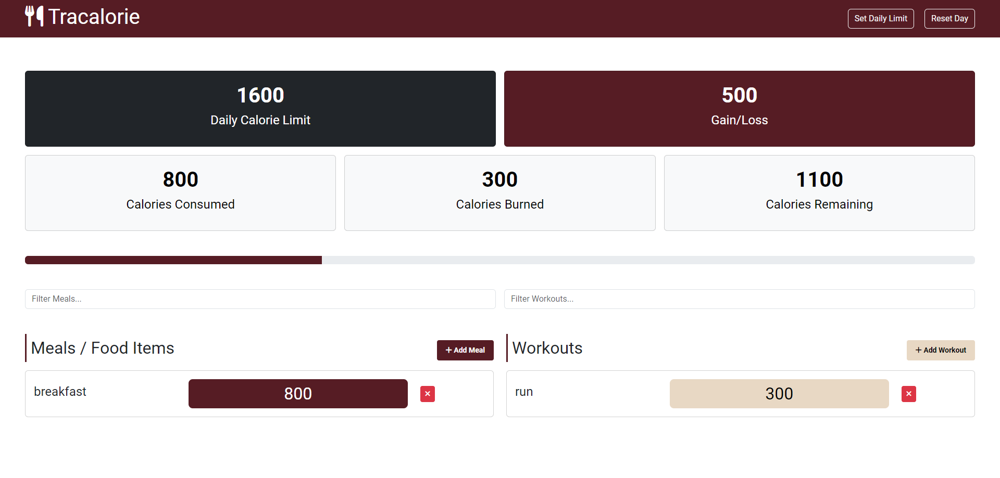

# Tracalorie

an App to track calories, meals and workouts

It's just an app that I practiced Webpack, Bootstrap 5 and Object Oriented Programming concepts in Javascript I hope you like it.

Demo: [https://peppy-lokum-2674f9.netlify.app/]



# How to run the app

to run tracalorie you simply use the following command

```js
npm run build
```
